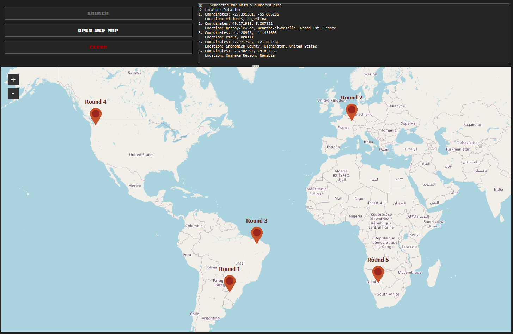

# OpenCheatr - OpenGuessr Location Detector


A desktop application that automatically detects and displays the round locations from OpenGuessr games. It monitors network traffic to capture location coordinates and displays them on an interactive map with detailed location information.

## Backstory

One of my friends likes to cheat in OpenGuessr, so I decided to quickly build this to cheat better than him. It's basically done as a joke - cheating is NOT cool.

## Features

- 🎯 Automatic detection of OpenGuessr round locations
- 🗺️ Interactive map display with numbered pins for each round
- 📍 Detailed location information with reverse geocoding
- 🌐 Browser-based map generation for detailed viewing
- 🔄 Real-time monitoring of OpenGuessr network traffic

## Dependencies

- tkinter - GUI framework
- playwright - Browser automation
- folium - Interactive map generation
- requests - HTTP requests for reverse geocoding
- tkintermapview - Embedded map widget (optional)

## Installation

1. Clone the repository
2. Optional: Setup a virtual environment so dependencies are not installed globally:

```bash
python3 -m venv venv
source venv/bin/activate  # On Windows: venv\Scripts\activate
```

3. Install dependencies

```bash
pip install -r requirements.txt
```

4. Install Playwright browser binaries (required for browser automation):

```bash
playwright install
```

5. Run the application:

```bash
python3 OpenCheatr.py
```

## Usage

1. **Launch the Application**: Run `OpenCheatr.py`
2. **Start Monitoring**: Click the "LAUNCH" button
3. **Play OpenGuessr**: A Chromium browser window will open to OpenGuessr.com
4. **Start a Game**: Begin any OpenGuessr game - the tool will automatically detect the round locations
5. **View Results**: 
   - See locations on the embedded map with numbered pins
   - Check the log panel for detailed location information
   - Click "OPEN WEB MAP" for a detailed browser-based map
6. **Clear and Restart**: Use "CLEAR" to reset and start a new game

## Map Features

- **Embedded Map**: Interactive map display within the application
- **Numbered Pins**: Each round location is marked with a number (1-5)
- **Location Details**: Reverse geocoding provides city, state, and country information
- **Browser Map**: Detailed map opens in your default browser with auto-refresh
- **Coordinate Display**: Exact latitude and longitude coordinates for each round

## Technical Details

- **Network Monitoring**: Uses Playwright to intercept OpenGuessr's location API calls
- **Reverse Geocoding**: Uses OpenStreetMap's Nominatim service for location details
- **Map Generation**: Creates interactive Folium maps with custom styling
- **Real-time Updates**: Automatically updates as new locations are detected

## File Structure

```
OpenCheatr/
├── OpenCheatr.py              # Main application file
├── assets/
│   └── I-pixel-u.ttf         # Custom pixel font
├── opencheatr_round_map.html  # Generated map file
└── README.md                  # This file
```

## Contributing

Contributions are welcome!
Please feel free to submit a Pull Request.

## License

MIT
